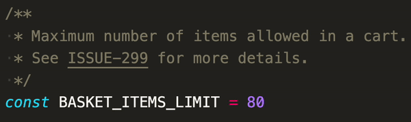

# Link Patterns

**Link Patterns** is a VS Code extension that automatically turns text into links based upon regex patterns.



## Status

This project is no longer actively maintained. Its spiritual successor is [Regex Robin](https://github.com/dlevs/vscode-regex-robin), which does everything this extension does, and more.

## Configuration

Multiple patterns can be defined in your VS Code settings. The following examples highlight common use cases.

```jsonc
{
  "patternlinks.rules": [
    {
      "linkPattern": "ISSUE-\\d+",
      "linkTarget": "https://myorg.atlassian.net/browse/$0"
      // Example URL: https://myorg.atlassian.net/browse/ISSUE-299
    },
    {
      "linkPattern": "(FOO|BAR)-(\\d+)",
      "linkTarget": "https://example.com/$1/$2",
      // Example URL: https://example.com/FOO/123

      // Limit to specific languages
      "languages": ["plaintext", "markdown"]
    },
    {
      "linkPattern": "SKU([A-Z_]+)",
      "linkTarget": "https://shop.com?search=$1&min-price=\\$1"
      // Example URL: https://shop.com?search=PRODUCT_CODE&min-price=$1
      // Here, `\` is being used as an escape character to prevent substitution
      // of the second `$1`.
    }
  ]
}
```

### Rule precedence

When two rules apply to the same text, the one defined last wins.

```jsonc
{
  "patternlinks.rules": [
    // Match links like repo-name#22 to the relevant pull request
    {
      "linkPattern": "([a-z_-]+)#(\\d+)",
      "linkPatternFlags": "i", // Case insensitive
      "linkTarget": "https://github.com/myorg/$1/pull/$2"
    },
    // Match links like special-case#22 to the relevant pull request,
    // which is in a different github organisation, and has a long,
    // inconvenient name.
    {
      "linkPattern": "special-case#(\\d+)",
      "linkTarget": "https://github.com/someorg/really-long-inconvenient-name/pull/$1"
    }
  ]
}
```

The text `special-case#22` technically matches both of these rules, but the second one is the one that takes effect.

<!--
⚠️ This relies on potentially undocumented behaviour.

This extension does not enforce this logic, but instead relies on the fact that VS Code
just works like this by default.

TODO: Register only one `LinkDefinitionProvider`, which returns a maximum of one link per text range.
 -->

## Contributing

1. Clone this repository
2. `npm install` to install dependencies
3. `npm run watch` to start the compiler in watch mode
4. Open this folder in VS Code and start the debugger (`F5`).
